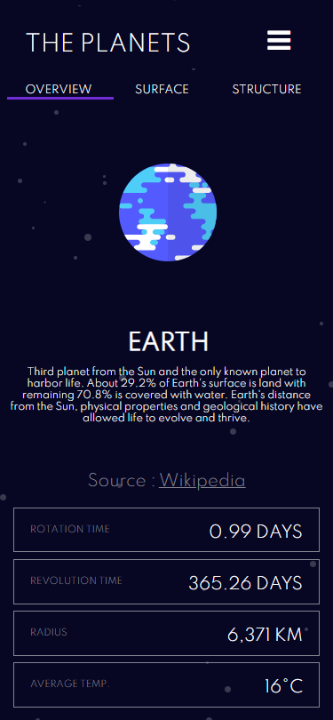
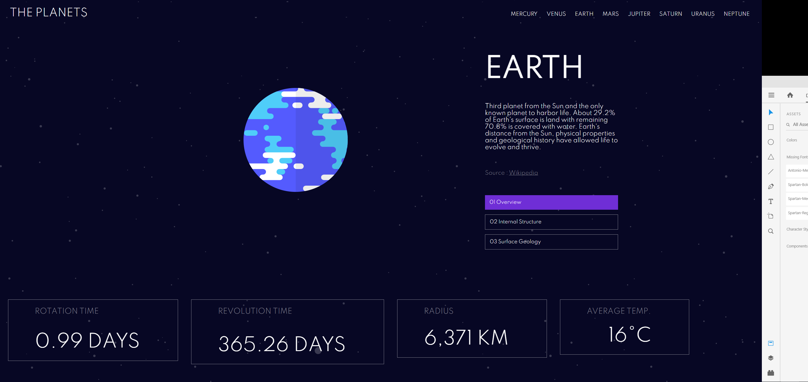
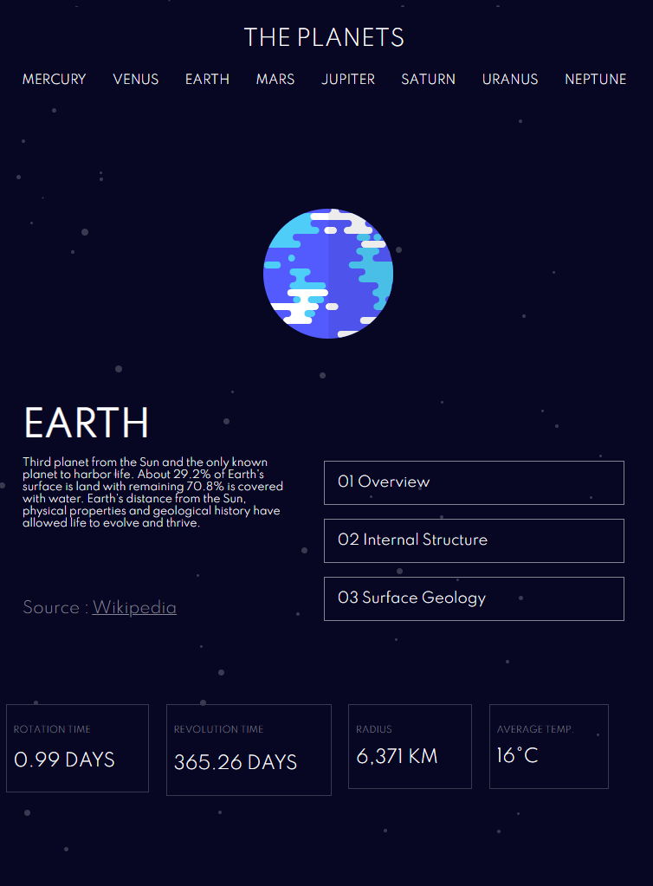

## Welcome! 👋

This is a solution to the [Planets fact site challenge on Frontend Mentor](https://www.frontendmentor.io/challenges/planets-fact-site-gazqN8w_f). Frontend Mentor challenges help you improve your coding skills by building realistic projects. 

## Table of contents

- [Overview](#overview)
  - [The challenge](#the-challenge)
  - [Screenshot](#screenshot)
  - [Links](#links)
- [My process](#my-process)
  - [Built with](#built-with)
  - [What I learned](#what-i-learned)
  - [Continued development](#continued-development)
  - [Useful resources](#useful-resources)
- [Author](#author)
- [Acknowledgments](#acknowledgments)

**Note: Delete this note and update the table of contents based on what sections you keep.**

## Overview

### The challenge

Users should be able to:

- View the optimal layout for the app depending on their device's screen size
- See hover states for all interactive elements on the page
- View each planet page and toggle between "Overview", "Internal Structure", and "Surface Geology"

### Screenshots

### Links

- Live Site URL: [Add live site URL here](https://your-live-site-url.com)

## My process

### Built with

- Semantic HTML5 markup
- CSS custom properties
- Vanilla Javascript
- Flexbox
- CSS Grid

### What I learned

In this project I learned how to take wireframes made in AdodeXD and turn them into a live website that is mobile responsive.
I learned more about css grid, creating mobile and tablet view, and learning how to to diplsay different texts and images with Javascript.

### Continued development

In future development I would like to use React to help me build applications faster and more efficient. I still have to countine learning javscript to get a better understanding of React, but in the future I hope to be more comfortable with javascript.

### Useful resources

- [Resource 1](https://developer.mozilla.org/en-US/docs/Web/JavaScript) - This helped me for learning vanilla javascript and css properties I did not fully understand. I really liked this pattern and will use it going forward.
- [Resource 2](https://stackoverflow.com/) - This is an amazing article which helped me understand things I could not find in the official documents. I'd recommend it to anyone to look at stackover flow for problems you are stuck on.

## Author

- Website - [Logan Bruesehoff](http://www.loganbruesehoff.live/index.html)

## Acknowledgments

This project came from Frontend mentor. I chose this project because I have a intrest in the solar system and in the cosmos. Front-end mentor provided me with the wireframes,images, and all the hex-colors, 
